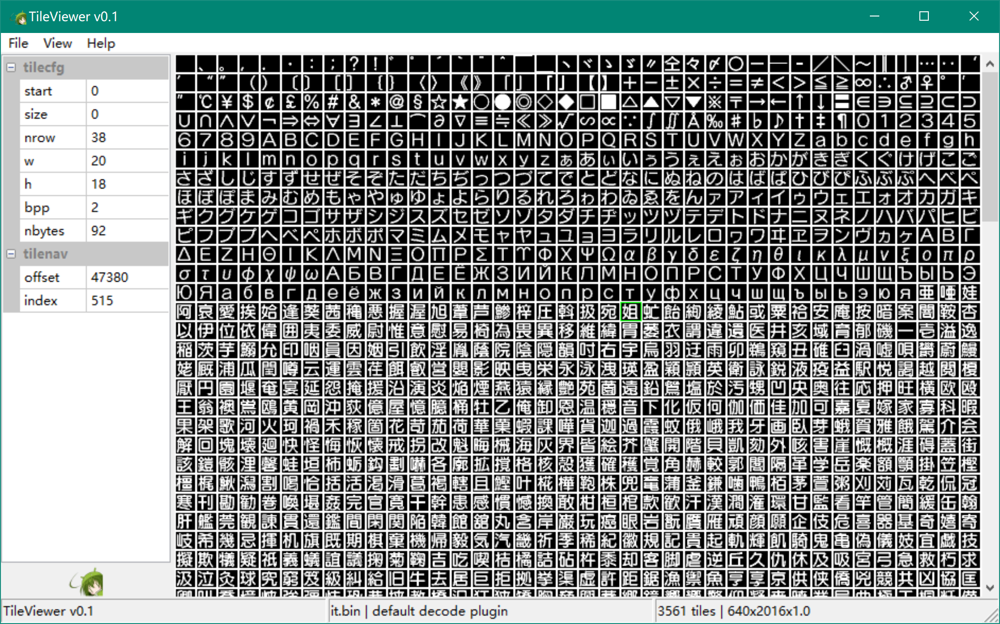
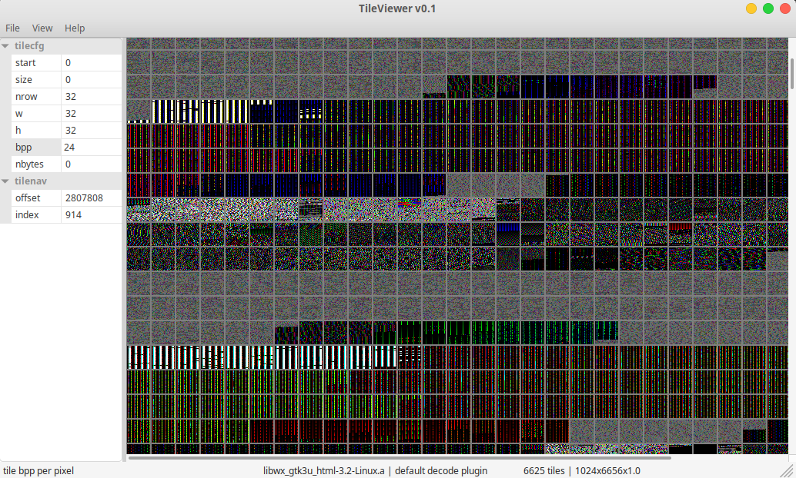
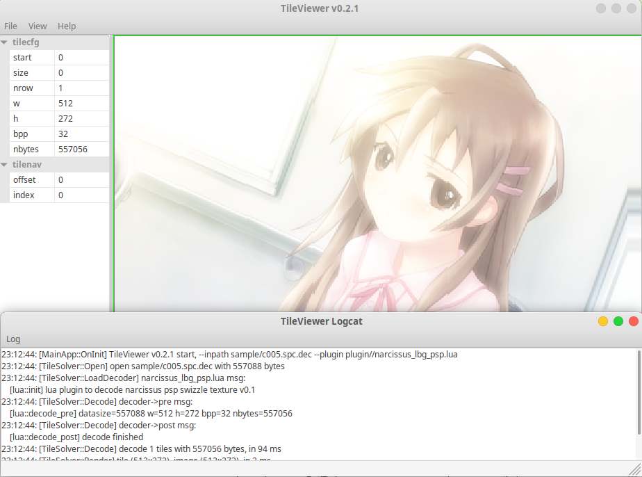
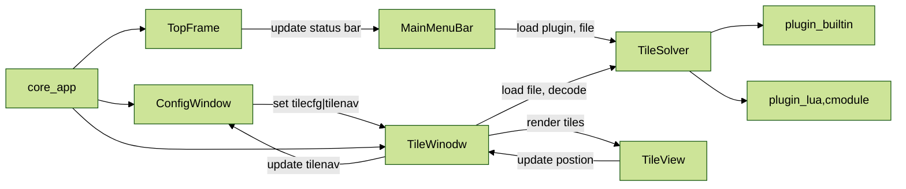

# Tile Viewer

 &style=flat-square) &style=flat-square)

☘️ A cross platform tool to visulize and analyze texture (usually used for console game font) by tiles.  It is inspired by `Crystal Tile 2`, and more flexible with custom lua script or C plugin (for more complex situation, such as swizzle) and command line support.  

Also, it supports for droping file, save decoded image and show cursor moving in tiles.  Futhermore, the window is flexible for changing size and support for zooming in and out with converting the client coordinate to logical coordinate.  

The main purpose is for analyzing game font or textures.  See [FontDB](https://github.com/YuriSizuku/TileViewer/wiki/Font-Database) and [TexDB](https://github.com/YuriSizuku/TileViewer/wiki/Texture-Database) in detail.  


(example of decoding a 2bpp tile font)

In addition, you can use it for data visulization tool as well.  


(example of data visulization)

## Usage

### (1) cmd

```sh
Usage: TileViewer [-n] [-i <str>] [-o <str>] [-p <str>] 
    [--start <num>] [--size <num>] [--nrow <num>] 
    [--width <num>] [--height <num>] [--bpp <num>] [--nbytes <num>] [-h] [--verbose]
  -n, --nogui         decode tiles without gui
  -i, --inpath=<str>  tile file inpath
  -o, --outpath=<str> outpath for decoded file
  -p, --plugin=<str>  plugin path to decode
  --plugincfg=<str>   plugin config path (default pluginpath.json)
  --pluginparam=<str> set the plugincfg values, for example {'name1': value1, 'name2': value2}
  --start=<num>       tile start offset
  --size=<num>        whole tile size
  --nrow=<num>        how many tiles in a row
  --width=<num>       tile width
  --height=<num>      tile height
  --bpp=<num>         tile bpp
  --nbytes=<num>      bytes number in a tile
  -h, --help          show this help message
  --verbose           generate verbose log messages
```

command line example

```sh
TileViewer --width 20 --height 18 --bpp 2 --nbytes 92 --inpath ../asset/sample/it.bin --outpath it.png
TileViewer --plugin ../asset/plugin/narcissus_lbg_psp.lua --inpath ../asset/sample/c005.spc.dec --outpath c005.spc.png
TileViewer --width 24 --height 24 --bpp 2 --pluginparam "{'endian': 1}" --inpath ../asset/sample/ZI24.FNT --outpath ZI24.png
```


(example of view swizzle texture by narcissus psp, using lua plugin)

### (2) gui

It will automaticly search plugins in `./plugin` path. You can use these shortcut to control the view.  

```sh
H|J|K|L cursor moving in tile view
CTRL+O open file
CTRL+L open log window
CTRL+S save decoded tile image
CTRL+B show border in each tile
CTRL++|WHELLUP scale up (zoom in)
CTRL+-|WHELLDOWN scale down (zoom out)
CTRL+R reset scale and fit window to best size
```


(example of using lua plugin to decode and scale scrolled view)

## Develop



### (1) Vscode

* c_cpp_properties.json

``` json
{
    "configurations": [
        {
            "name": "Linux x64",
            "includePath": [
                "${workspaceFolder}/src/**", 
                "${workspaceFolder}/build_linux64/**", 
                "${workspaceFolder}/depend/lua-5.4.7/src/**", 
                "${workspaceFolder}/depend/cJSON-1.7.18/**", 
                "${workspaceFolder}/depend/wxWidgets-3.2.6/include"
            ],
            "defines": ["__WXGTK__", "__LINUX__"],
            "compilerPath": "/usr/bin/gcc",
            "cStandard": "c99",
            "cppStandard": "c++11",
            "intelliSenseMode": "linux-gcc-x64"
        }
    ],
    "version": 4
}
```

* launch.json

``` json
{
    "version": "0.2.0",
    "configurations": [
        {
            "name": "Linux x64",
            "type": "cppdbg",
            "request": "launch",
            "program": "${workspaceRoot}/build_linux64/TileViewer",
            "args": ["--inpath", "sample/Nobara1.bmp",  "--width", "20", "--height", "18", "--bpp 2", "--nbytes 92", 
                    "--plugin", "plugin/util_bmp.lua"],
            "stopAtEntry": false,
            "cwd": "${workspaceRoot}/asset/",
            "environment": [],
            "externalConsole": false,
            "MIMode": "gdb",
            "setupCommands": [
                {
                    "description": "Enable pretty-printing for gdb",
                    "text": "-enable-pretty-printing",
                    "ignoreFailures": true
                },
                {
                    "description": "Set Disassembly Flavor to Intel",
                    "text": "-gdb-set disassembly-flavor intel",
                    "ignoreFailures": true
                }
            ]
        }
    ]
}
```

### (2) C plugin

Implement these function for C decoder plugin, then export either struct `decoder` or function `get_decoder`, see `src/plugin.h` in detail.  

Here's the workflow for the plugin `open -> (sendui) -> ||(recvui) -> (pre) -> decode -> (post) :|| -> close`.  

``` C

struct tile_decoder_t
{
    uint32_t version; // required tileviewer version, for example v0.3.4 = 340
    uint32_t size; // this structure size
    void* context; // opaque pointer for decoder context, user defined struct
    const char *msg; // for passing log informations to log window
    REQUIRED CB_decode_open open; // open the decoder when loading decoder
    REQUIRED CB_decode_close close; // close the decoder when changing decoder
    REQUIRED CB_decode_pixel decodeone; // decode one pixel (fill the (i, x, y) pixel)
    REQUIRED CB_decode_pixels decodeall; // decode all pixels (if not find decodeall, it will use decodeone)
    OPTIONAL CB_decode_parse pre; // before decoding whole tiles (usually make some tmp values here)
    OPTIONAL CB_decode_parse post; // after decoding whole tiles(usually clean some tmp values here)
    OPTIONAL CB_decode_send sendui; // for setting ui widget (it will search xxx.json at first, if not found, use this)
    OPTIONAL CB_decode_recv recvui; // for getting ui widget
};
```

plugincfg example in built-in

```json
{
    "plugincfg": 
    [
        {"name" : "endian", "type": "enum", "options":["little", "big"], "value": 1}
    ]
}
```

extern c module example `asset/util_stb.c`

``` sh
mkdir -p build_mingw64/plugin
. script/fetch_depend.sh
fetch_stb
gcc -g -Idepend/stb-lastest -Isrc -fPIC -fvisibility=hidden -static-libgcc -shared asset/plugin/util_stb.c -o build_mingw64/plugin/util_stb.dll
```

### (3) Lua plugin

Implement `decode_pre`,  `decode_pixel` and `decode_post` to decode tiles. You can use capi functions as below, usually in `decode_pre` to reduce overhead. See `asset/plugin/` in detail.  

As for debugging lua script, one way is to use `log` to print values in logwindow; the other way is to redirct `stderr` to file, for example `TileViewer.exe -i c005.spc.dec --plugin plugin/narcissus_lbg_psp.lua >plugin_log.txt 2>&1`

Notice that the **lua index is start from 1** !

``` lua
-- c types declear
---@class tilecfg_t
---@field start integer
---@field size integer
---@field nrow integer
---@field w integer
---@field h integer
---@field bpp integer
---@field nbytes integer

-- capis declear 
log = log -- use log(...) to redirect to log window

---@type fun() : tilecfg_t
function get_tilecfg() return {} end -- capi

---@type fun(tilecfg_t)
function set_tilecfg(cfg) end -- capi

---@type fun(): integer
function get_rawsize() return 0 end -- capi

-- get tiles bytes, usually used in decode_pre, and then use this to decode pixel
---@type fun(offset:integer, size: integer): string
function get_rawdata(offset, size) return "" end --capi

-- c callbacks implement
---@type fun() : boolean 
function decode_pre() -- callback for pre process
    -- implement your code here
    return true
end

---@type fun( i: integer, x: integer, y: integer) : integer
function decode_pixel(i, x, y) -- callback for decoding tile i, (x, y) position
    -- implement your code here
end

---@type fun() : boolean 
function decode_post() -- callback for post process
    -- implement your code here
    return true
end
```

### (4) .Net plugin

[TileViewer.Plugin.Dotnet](https://github.com/UtawareruDD/TileViewer.Plugin.Dotnet)
This repository hosts a .NET 9 AOT-ready managed plugin skeleton for TileViewer. The project replaces the native tile_decoder_t callbacks with safe managed abstractions while keeping method parity so it can be used as a starting point for C# implementations.

How to use

Create a new class implementing IConfigurableTileDecoder. If you don’t know how to start, see [MainTileDecoder](https://github.com/UtawareruDD/TileViewer.Plugin.Dotnet/blob/main/TileViewer.Plugin.Dotnet/Decoders/MainTileDecoder.cs) (demo).


## Build

### (1) Windows

Install `llvm-mingw` (or [i686-11.2.0-release-win32-dwarf-rt_v9-rev1](https://github.com/niXman/mingw-builds-binaries/releases/download/11.2.0-rt_v9-rev1/i686-11.2.0-release-win32-dwarf-rt_v9-rev1.7z) compatible for `winxp`) at first

``` sh
echo "## init_llvmmingw ${LLVMMINGW_HOME}"
if [ -n "$(uname -a | grep Linux)" ]; then
    curl -fsSL https://github.com/mstorsjo/llvm-mingw/releases/download/20240619/llvm-mingw-20240619-msvcrt-ubuntu-20.04-x86_64.tar.xz -o /tmp/llvm-mingw.tar.xz
    tar xf /tmp/llvm-mingw.tar.xz -C /tmp
    _tmppath=/tmp/llvm-mingw-20240619-msvcrt-ubuntu-20.04-x86_64 
    mv -f ${_tmppath} $LLVMMINGW_HOME || echo "try to use sudo mv to $LLVMMINGW_HOME" && sudo mv -f ${_tmppath} $LLVMMINGW_HOME
    rm -rf /tmp/llvm-mingw.tar.xz
else
    curl -fsSL https://github.com/mstorsjo/llvm-mingw/releases/download/20240619/llvm-mingw-20240619-msvcrt-x86_64.zip -o ~/llvm-mingw.zip
    7z x ~/llvm-mingw.zip -o$HOME
    mv -f ~/llvm-mingw-20240619-msvcrt-x86_64 $LLVMMINGW_HOME
    rm -rf ~/llvm-mingw.zip
fi
```

then fetch depends and build (choose different CC to build x86 or x64)

``` sh
git clone https://github.com/YuriSizuku/TileViewer.git
cd TileViewer
bash script/fetch_depend.sh

# windows llvm-mingw x64 debug
sh -c "CC=x86_64-w64-mingw32-clang BUILD_DIR=$(pwd)/build_mingw64 BUILD_TYPE=Debug script/build_mingw.sh"
# windows llvm-mingw x86 release
sh -c "CC=i686-w64-mingw32-clang BUILD_DIR=$(pwd)/build_mingw32 BUILD_TYPE=MinSizeRel script/build_mingw.sh"
# windows llvm-mingw aarch64 debug
sh -c "CC=aarch64-w64-mingw32-clang WINDRES=aarch64-w64-mingw32-windres  BUILD_DIR=$(pwd)/build_mingwa64 BUILD_TYPE=Debug script/build_mingw.sh"

# linux mingw x64 debug
CC=x86_64-w64-mingw32-gcc CXX=x86_64-w64-mingw32-g++ WINDRES=x86_64-w64-mingw32-windres BUILD_DIR=build_mingw64 bash script/build_mingw.sh
# linux mingw x86 release (use gcc below 12 for xp)
CC=i686-w64-mingw32-gcc CXX=i686-w64-mingw32-g++ WINDRES=i686-w64-mingw32-windres BUILD_DIR=build_mingw32 BUILD_TYPE=MinSizeRel bash script/build_mingw.sh
```

### (2) Linux

Install dependencies at first

``` sh
# for general
sudo apt-get -y install build-essential
sudo apt-get -y install p7zip-full git cmake
sudo apt-get -y install libgtk-3-dev

# for cross x86
sudo dpkg --add-architecture i386
sudo apt-get -y update
sudo apt-get -y install gcc-multilib g++-multilib gdb-multiarch
sudo apt-get -y install crossbuild-essential-i386
sudo apt-get -y install libc6:i386 libx11-dev:i386 libxtst-dev:i386 libsm-dev:i386
sudo apt-get -y install libgtk-3-dev:i386 

# for cross armhf
sudo dpkg --add-architecture armhf
sudo apt-get -y update
sudo apt-get -y install crossbuild-essential-armhf
sudo apt-get -y install crossbuild-essential-arm64
sudo apt-get -y install libc6:armhf libx11-dev:armhf libxtst-dev:armhf libsm-dev:armhf
sudo apt-get -y install libgtk-3-dev:armhf 
```

linux local build

``` sh
git clone https://github.com/YuriSizuku/TileViewer.git
cd TileViewer
chmod +x script/*.sh

# linux x64 debug
CC=x86_64-linux-gnu-gcc CXX=x86_64-linux-gnu-g++ BUILD_DIR=build_linux64 BUILD_TYPE=Debug bash script/build_linux.sh

# linux x86 debug
CC=i686-linux-gnu-gcc CXX=i686-linux-gnu-g++ BUILD_DIR=build_linux32 BUILD_TYPE=Debug bash script/build_linux.sh
```

linux cross build by docker

``` sh
sudo apt-get -y install qemu-user-static binfmt-support

export DOCKER_ARCH=i386 BUILD_DIR=build_linux32_docker BUILD_TYPE=MinSizeRel && bash script/build_docker.sh
export DOCKER_ARCH=x86_64 BUILD_DIR=build_linux64_docker BUILD_TYPE=MinSizeRel && bash script/build_docker.sh
export DOCKER_ARCH=armhf BUILD_DIR=build_linuxa32_docker BUILD_TYPE=MinSizeRel USE_BUILDX=1 && bash script/build_docker.sh
export DOCKER_ARCH=aarch64 BUILD_DIR=build_linuxa64_docker BUILD_TYPE=MinSizeRel USE_BUILDX=1 && bash script/build_docker.sh
```

### (3) macOS

``` sh

# install Xcode Command Line Tools
xcode-select --install

# install Homebrew
/bin/bash -c "$(curl -fsSL https://raw.githubusercontent.com/Homebrew/install/HEAD/install.sh)"

# install dependency using Homebrew
brew install wxwidgets
brew install p7zip
brew install gtk+3
brew install cmake

git clone https://github.com/YuriSizuku/TileViewer.git
cd TileViewer
chmod +x script/*.sh
./script/build_macos.sh

```

## Roadmap

* Core
  * [x] redirect log message to log window
  * [x] implement command lines  
  * [x] decoder interface with different plugin (builtin, lua, C)
  * [x] automaticaly reload the plugin when it changes ([v0.3.2](https://github.com/YuriSizuku/TileViewer/releases/tag/v0.3.2))
  * [x] use json to transfer infromation from ui to decoder

* Plugin
  * [x] plugin built-in decoder, ([v0.1](https://github.com/YuriSizuku/TileViewer/releases/tag/v0.2))
    * [x] 2|4|8 bpp, little endian
    * [x] 3bpp (3 bytes for 8 pixels) ([v0.3.3.7](https://github.com/YuriSizuku/TileViewer/releases/tag/v0.3.3.7))
    * [x] 16bpp(rgb565), 24bpp(rgb888), 32bpp(rgba8888)  
    * [x] plugincfg, endian, channel_first, bgr, flip ([v0.3.4.3](https://github.com/YuriSizuku/TileViewer/releases/tag/v0.3.3.7))
  * [x] plugin lua decoder ([v0.2](https://github.com/YuriSizuku/TileViewer/releases/tag/v0.2))
    * [x] set/get raw data, set/get tilecfg, tilenav
    * [x] raw memory operations, memnew, memdel, memread, memwrite ([v0.3.5](https://github.com/YuriSizuku/TileViewer/releases/tag/v0.3.5))
    * [x] lua extra part to invoke wxwidgets ([v0.3.5.2](https://github.com/YuriSizuku/TileViewer/releases/tag/v0.3.5.2))
  * [x] plugin C decoder (dll, so) ([v0.3](https://github.com/YuriSizuku/TileViewer/releases/tag/v0.3))

* UI
  * [x] start up with hello world, cmake structure for the project  
  * [x] inital layout, left config view, right tile view, top menu, bottom status
  * [x] select and render tiles in real time when format changes
  * [x] scale render tile images (zoom in/out) ([v0.1.5](https://github.com/YuriSizuku/TileViewer/releases/tag/v0.1.2))
  * [ ] color palette load, save editor  (partly sovled by plugin)
  * [x] cmodule plugincfg in left property ([v0.3.4](https://github.com/YuriSizuku/TileViewer/releases/tag/v0.3.4))
  * [x] lua plugincfg in left property ([v0.3.4.2](https://github.com/YuriSizuku/TileViewer/releases/tag/v0.3.4.2))

* Build
  * [x] use github action to auto build ([v0.1](https://github.com/YuriSizuku/TileViewer/releases/tag/v0.1))
  * [x] llvm-mingw compile (x86, x64) ([v0.1](https://github.com/YuriSizuku/TileViewer/releases/tag/v0.1))
  * [x] linux compile (x86, x64) ([v0.1.2](https://github.com/YuriSizuku/TileViewer/releases/tag/v0.1.2))
  * [x] linux cross compile by docker (arm32, arm64) ([v0.1.3](https://github.com/YuriSizuku/TileViewer/releases/tag/v0.1.2))
  * [x] windows xp support (by i686-w64-mingw32-gcc (below gcc 12), llvm-mingw not worked, because of tls ? ) ([v0.3.3.2](https://github.com/YuriSizuku/TileViewer/releases/tag/v0.3.3.2))
  * [x] mac local compile (contributed by [TomJinW](https://github.com/TomJinW))

## Issues

## Credit

[wxWidget](https://www.wxwidgets.org/)  
[Lua](https://www.lua.org/)  
[cJSON](https://github.com/DaveGamble/cJSON)  
[CrystalTile2](https://www.gamebrew.org/wiki/CrystalTile2)  
